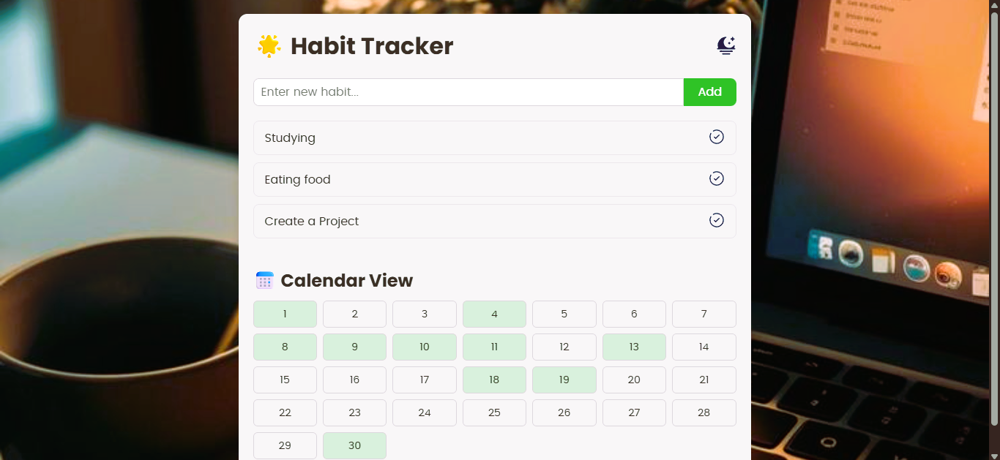

# 🌟 Habit Tracker

A modern, responsive web app to track your daily habits, built with vanilla JavaScript, HTML, and CSS.  
Includes streak tracking, calendar visualization, and dark/light theme toggle.

---

## 📸 Screenshot

## 🧩 Features

- Add and track daily habits with streak counters 🔥  
- Mark habits as done for the day with visual feedback and sound  
- 30-day calendar view with random active day highlights  
- Light and Dark theme toggle with icon switch  
- Data persistence using `localStorage`  
- Responsive design for desktop and mobile devices

---

## 🚀 Getting Started

1. Clone or download this repository  
2. Open `index.html` in your favorite browser  
3. Start adding and tracking your habits!

_No server or build tools required — pure frontend app._

---

## 🖥️ How to Use

- **Add a Habit:** Type a habit name in the input box and click **Add**  
- **Mark Done:** Click the checkmark button next to a habit to mark it as done for today (plays a ding sound)  
- **Streak:** The flame icon (🔥) shows your current streak of consecutive days for each habit  
- **Calendar:** View a 30-day calendar with some days highlighted (for demo/random visualization)  
- **Theme Toggle:** Click the moon/sun icon to switch between light and dark themes  

---

## 🎨 Customization

- Update background image in `style.css` under `body { background: url(...) }`  
- Replace or add new icons and sounds in the `assets` folder  
- Adjust calendar days or active days logic in `script.js` inside `renderCalendar()` function  

---

## 🤝 Contributing  

Feel free to fork the project, improve it, and submit pull requests!

Ideas:  
- Add real calendar integration showing actual completion dates  
- Enable editing and deleting habits  
- Add reminders and notifications  
- Store data on a backend or cloud for multi-device sync  
- Enhance accessibility (keyboard navigation, screen reader support)  

---

## 💡 Inspiration  

Built to help users build healthy habits with a simple, visually appealing interface and gamification elements like streaks and sound effects to encourage consistency.

---

## 📄 License  

This project is licensed under the **MIT License**.

---

## 👩‍💻 Author  

Created by [Nomanguni Khumalo](https://github.com/Nomahk25) — Helping you build better habits every day!
